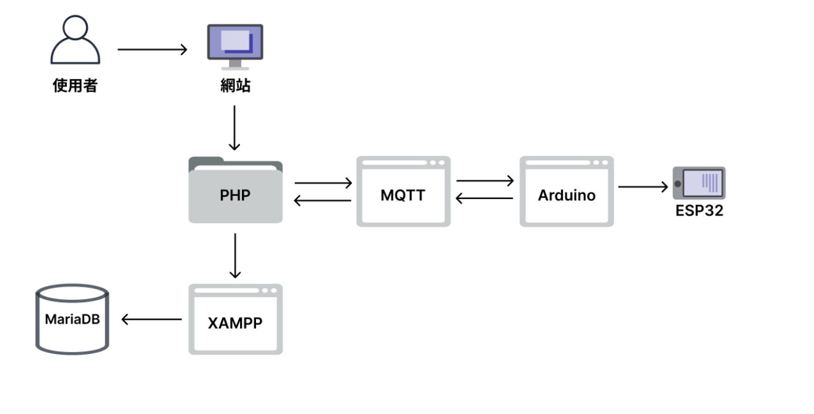
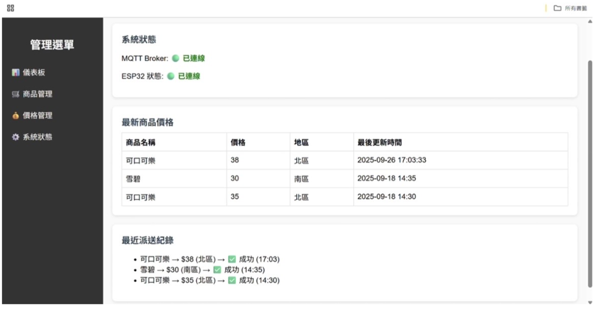
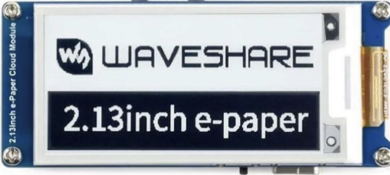

{\rtf1\ansi\ansicpg950\cocoartf2870
\cocoatextscaling0\cocoaplatform0{\fonttbl\f0\fswiss\fcharset0 Helvetica;}
{\colortbl;\red255\green255\blue255;}
{\*\expandedcolortbl;;}
\paperw11900\paperh16840\margl1440\margr1440\vieww11520\viewh8400\viewkind0
\pard\tx720\tx1440\tx2160\tx2880\tx3600\tx4320\tx5040\tx5760\tx6480\tx7200\tx7920\tx8640\pardirnatural\partightenfactor0

\f0\fs24 \cf0 # \uc0\u28961 \u32025 \u38642 \u25511  \'97\'97 \u26234 \u24935 \u38651 \u23376 \u32025 \u27161 \u31844 \u31649 \u29702 \u31995 \u32113  (Cloud-Controlled E-Paper ESL System)\
\
>  **\uc0\u26481 \u21555 \u22823 \u23416 \u36039 \u35338 \u31649 \u29702 \u23416 \u31995  \u30050 \u26989 \u23560 \u38988 \u31478 \u36093  \'97\'97 \u31532 \u19968 \u21517 **\
\
\uc0\u26412 \u23560 \u26696 \u26159 \u19968 \u22871 \u32080 \u21512  **\u29289 \u32879 \u32178  (IoT)**\u12289 **MQTT \u21363 \u26178 \u36890 \u35338 \u21332 \u23450 ** \u33287  **Web \u38642 \u31471 \u31649 \u29702 \u24179 \u21488 ** \u30340 \u26234 \u24935 \u38651 \u23376 \u36008 \u26550 \u27161 \u31844  (Electronic Shelf Label, ESL) \u35299 \u27770 \u26041 \u26696 \u12290 \u37341 \u23565 \u33258 \u21205 \u36009 \u36067 \u27231 \u33287 \u20013 \u23567 \u22411 \u38646 \u21806 \u36890 \u36335 \u65292 \u35299 \u27770 \u20659 \u32113 \u32025 \u26412 \u27161 \u31844 \u25163 \u21205 \u26356 \u25563 \u32791 \u26178 \u12289 \u23481 \u26131 \u37679 \u20729 \u19988 \u28961 \u27861 \u21363 \u26178 \u32879 \u32178 \u35519 \u20729 \u30340 \u30171 \u40670 \u65292 \u33853 \u23526 \u20302 \u21151 \u32791 \u33287  ESG \u27704 \u32396 \u31649 \u29702 \u12290 \
\
---\
\
##  \uc0\u31995 \u32113 \u19977 \u22823 \u26680 \u24515 \u29305 \u33394 \
\
1. **\uc0\u19977 \u23652 \u24335 \u31471 \u21040 \u31471 \u26550 \u27083  (End-to-End IoT Architecture)**\u65306 \
   - **\uc0\u20171 \u38754 \u23652  (Web Management)**\u65306 \u25552 \u20379 \u24460 \u21488 \u25805 \u20316 \u20171 \u38754 \u33287  RESTful API\u65292 \u25903 \u25588 \u21830 \u21697 \u31649 \u29702 \u12289 \u21363 \u26178 \u25913 \u20729 \u33287 \u25209 \u27425 \u25490 \u31243 \u26356 \u26032 \u12290 \
   - **\uc0\u36039 \u26009 \u23652  (Cloud Database)**\u65306 \u20197 \u38364 \u32879 \u24335 \u36039 \u26009 \u24235 \u38598 \u20013 \u25511 \u31649 \u21830 \u21697 \u33287 \u35373 \u20633 \u29376 \u24907 \u65292 \u32173 \u35703 \u25976 \u25818 \u19968 \u33268 \u24615 \u33287 \u23433 \u20840 \u24615 \u12290 \
   - **\uc0\u35037 \u32622 \u23652  (Hardware Edge)**\u65306 ESP32 \u25511 \u21046 \u26680 \u24515 \u32080 \u21512 \u20302 \u21151 \u32791  Wi-Fi\u65292 \u39493 \u21205  Waveshare 2.13 \u21515 \u38651 \u23376 \u32025 \u27169 \u32068 \u12290 \
\
2. **MQTT \uc0\u20302 \u24310 \u36978 \u30332 \u24067 /\u35330 \u38321 \u24291 \u25773  (Publish/Subscribe Protocol)**\u65306 \
   - \uc0\u25448 \u26820 \u20659 \u32113 \u36650 \u35426  (Polling)\u65292 \u25505 \u29992  MQTT Broker \u23526 \u29694 \u20282 \u26381 \u22120 \u33267 \u37002 \u32227 \u30828 \u39636 \u30340 \u12300 \u19968 \u23565 \u22810 \u21363 \u26178 \u24291 \u25773 \u12301 \u12290 \
   - \uc0\u30070 \u24460 \u31471 \u20729 \u26684 \u30064 \u21205 \u26178 \u65292 \u27627 \u31186 \u32026 \u25512 \u36865 \u26356 \u26032 \u25351 \u20196 \u65292 \u30906 \u20445 \u25152 \u26377 \u32066 \u31471 \u27161 \u31844 \u21516 \u27493 \u65292 \u39023 \u33879 \u38477 \u20302 \u32178 \u36335 \u20659 \u36664 \u38971 \u23532 \u33287 \u24310 \u36978 \u12290 \
\
3. **\uc0\u26997 \u20302 \u21151 \u32791 \u33287 \u38626 \u32218 \u23481 \u37679 \u27231 \u21046 **\u65306 \
   - \uc0\u21033 \u29992 \u38651 \u23376 \u32025 \u12300 \u38617 \u31337 \u24907 \u65288 \u26039 \u38651 \u20173 \u21487 \u20445 \u25345 \u30059 \u38754 \u65289 \u12301 \u29305 \u24615 \u33287  ESP32 \u28145 \u24230 \u30561 \u30496 \u27169 \u24335  (Deep Sleep)\u65292 \u23526 \u29694 \u26997 \u38263 \u24453 \u27231 \u26178 \u38291 \u12290 \
   - **\uc0\u26039 \u32218 \u20445 \u30495 **\u65306 \u33509 \u36935 \u32178 \u36335 \u20013 \u26039 \u65292 \u32066 \u31471 \u30828 \u39636 \u20445 \u30041 \u26368 \u24460 \u19968 \u27425 \u26356 \u26032 \u20729 \u26684 \u65292 \u36991 \u20813 \u29151 \u36939 \u20013 \u26039 \u33287 \u36039 \u35338 \u37679 \u20098 \u12290 \
\
---\
\
##  \uc0\u38283 \u30332 \u25216 \u34899 \u33287 \u24037 \u20855 \
\
- **\uc0\u24460 \u31471 \u33287 \u24179 \u21488 **\u65306 PHP, Apache, MariaDB, RESTful API\
- **\uc0\u36890 \u35338 \u21332 \u23450 **\u65306 MQTT Broker (Publish/Subscribe \u27169 \u24335 )\
- **\uc0\u37002 \u32227 \u30828 \u39636 \u33287 \u38860 \u39636 **\u65306 ESP32 \u38283 \u30332 \u26495 , Waveshare 2.13 \u21515 \u38651 \u23376 \u32025 \u27169 \u32068 , Arduino C/C++\
- **\uc0\u31995 \u32113 \u20998 \u26512 \u33287 \u35373 \u35336 **\u65306 UML \u24314 \u27169 \u12289 ER Model\u12289 \u36039 \u26009 \u24235 \u27491 \u35215 \u21270 \u35373 \u35336 \
\
---\
\
##  \uc0\u31995 \u32113 \u26550 \u27083 \u33287 \u25104 \u26524 \u23637 \u31034 \
\
### 1. \uc0\u31995 \u32113 \u26550 \u27083 \u27969 \u31243 \u22294 \
\
\
### 2. \uc0\u38642 \u31471 \u24460 \u21488 \u31649 \u29702 \u20736 \u34920 \u26495  (\u21363 \u26178 \u36899 \u32218 \u33287 \u35519 \u20729 \u30435 \u25511 )\
\
\
### 3. \uc0\u38651 \u23376 \u32025 \u30828 \u39636 \u31471 \u23637 \u31034 \
\
\
---\
\
##  \uc0\u23436 \u25972 \u25216 \u34899 \u25991 \u20214 \
\uc0\u35443 \u32048 \u23560 \u38988 \u30740 \u31350 \u22577 \u21578 \u35531 \u21443 \u38321 \u65306 [`docs/project_report.pdf`](docs/project_report.pdf)}